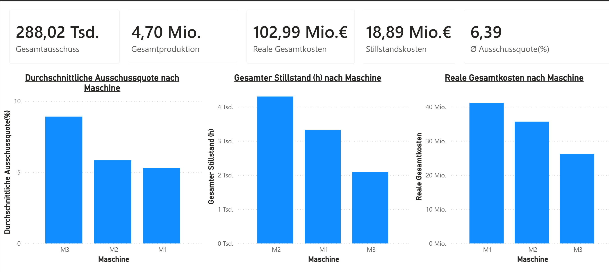

# 📈 Production Analysis Dashboard (Power BI)

## 🎯 Projektziel

Visualisierung von Produktions-, Ausschuss- und Stillstandsdaten zur Identifikation von Kosten- und Qualitätsproblemen.

## 🛠️ Verwendete Tools
- Power BI
- Python
- SQL

## 📊 Dashboard-Inhalte
- Gesamtproduktion
- Ausschussquote
- Reale Gesamtkosten
- Stillstandskosten
- Maschinenvergleich

## 🔍 Wichtige Erkenntnisse
- Maschine 3 zeigt die höchste Ausschussquote
- Maschine 2 verursacht die höchsten Stillstandskosten
- Maschine 1 erzeugt die höchsten Gesamtkosten aufgrund der höchsten Produktionsmenge

## 🖼️ Dashboard Vorschau

