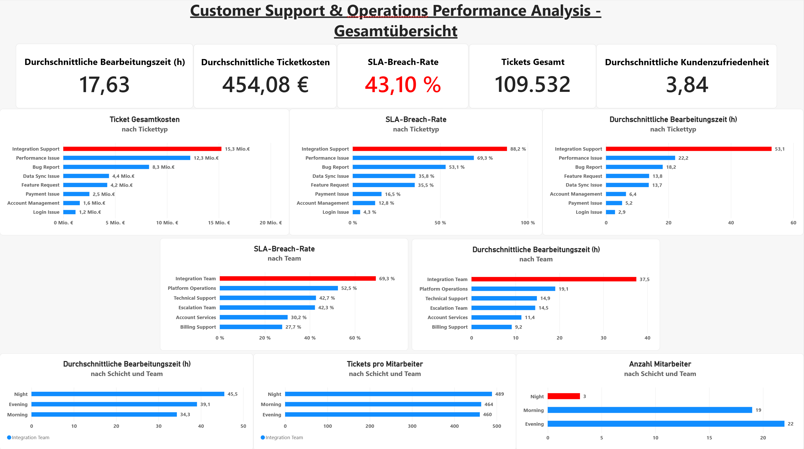
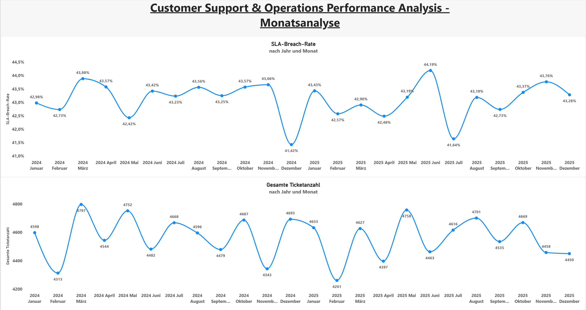

# Customer Support & Operations Analysis – Power BI

## Projektübersicht

Dieses Projekt ist Teil meines Portfolios als angehender Data Analyst und basiert auf einem realistischen Customer-Support-Use-Case.

Ziel des Power-BI-Dashboards ist es, die Ergebnisse der Python- und SQL-Analysen übersichtlich darzustellen und die wichtigsten operativen Problemfelder auf einen Blick erkennbar zu machen.

Der Fokus lag dabei auf:

- Visualisierung zentraler Support-KPIs
- Vergleich von Tickettypen und Teams
- Analyse von SLA-Breaches und Bearbeitungszeiten
- Untersuchung der Schicht- und Mitarbeiterstruktur des Integration Teams
- Darstellung der zeitlichen Entwicklung wichtiger Kennzahlen
- Aufbereitung der Analyseergebnisse für eine übersichtliche Management-Darstellung

## Datensatz

Das Dashboard basiert auf drei miteinander verbundenen CSV-Dateien:

- Kunden: 13.251 Datensätze
- Mitarbeiter: 400 Datensätze
- Support-Tickets: 109.532 Datensätze

Die Daten wurden zuvor mit Python generiert und aufbereitet sowie anschließend für die SQL- und Power-BI-Analysen verwendet.

## Datenmodell

Die Tabellen wurden in Power BI über gemeinsame IDs miteinander verknüpft:

- `customers[customer_id]` → `support_tickets[customer_id]`
- `employees[employee_id]` → `support_tickets[employee_id]`

Dadurch können die Support-Tickets nach Kunden- und Mitarbeitermerkmalen analysiert werden.

## KPI-Kennzahlen

Für das Dashboard wurden unter anderem folgende Kennzahlen verwendet:

- Gesamtanzahl Tickets
- durchschnittliche Bearbeitungszeit
- durchschnittliche Ticketkosten
- SLA-Breach-Rate
- durchschnittliche Kundenzufriedenheit
- Gesamtkosten nach Tickettyp
- Bearbeitungszeit nach Tickettyp
- SLA-Breach-Rate nach Tickettyp
- SLA-Breach-Rate nach Team

Zusätzlich wurde das Integration Team detaillierter nach Schicht betrachtet:

- durchschnittliche Bearbeitungszeit
- Tickets pro Mitarbeiter
- Anzahl Mitarbeiter

## Dashboard-Aufbau

Das Dashboard besteht aus zwei Seiten.

### 1. Gesamtübersicht

Die erste Seite stellt die wichtigsten Ergebnisse der Supportanalyse zusammen.

Enthalten sind:

- zentrale Support-KPIs
- Ticketkosten nach Tickettyp
- SLA-Breach-Rate nach Tickettyp
- durchschnittliche Bearbeitungszeit nach Tickettyp
- SLA-Breach-Rate nach Team
- durchschnittliche Bearbeitungszeit nach Team
- Bearbeitungszeit nach Schicht im Integration Team
- Tickets pro Mitarbeiter im Integration Team
- Anzahl Mitarbeiter nach Schicht im Integration Team

Die Darstellung folgt dabei einer schrittweisen Analyse:

**Gesamtsituation → Tickettypen → Teams → Integration Team → Schicht- und Ressourcenstruktur**

Dadurch werden zunächst die allgemeinen Problemfelder dargestellt und anschließend mögliche operative Auffälligkeiten detaillierter untersucht.

### 2. Monatsanalyse

Die zweite Seite zeigt die zeitliche Entwicklung der Support-Performance über die Jahre 2024 und 2025.

Dargestellt werden:

- SLA-Breach-Rate nach Monat
- Gesamtanzahl der Tickets nach Monat

Die Monatsanalyse dient dazu zu überprüfen, ob die identifizierten Probleme durch saisonale Schwankungen oder einzelne zeitlich begrenzte Belastungsspitzen beeinflusst werden.

## Zentrale Erkenntnisse

Das Power-BI-Dashboard visualisiert die wesentlichen Ergebnisse der vorherigen Python- und SQL-Analysen.

### Tickettypen

Integration Support weist:

- die höchsten Gesamtkosten
- die höchsten durchschnittlichen Ticketkosten
- die längste durchschnittliche Bearbeitungszeit
- die höchste SLA-Breach-Rate

auf.

Performance Issues und Bug Reports verursachen aufgrund ihres hohen Ticketvolumens ebenfalls relevante Gesamtkosten.

### Teamanalyse

Das Integration Team weist die höchsten SLA-Breach-Raten und die längsten durchschnittlichen Bearbeitungszeiten auf.

Die Ergebnisse müssen jedoch im Zusammenhang mit der Ticketzusammensetzung betrachtet werden, da das Team einen hohen Anteil komplexer Integration-Support-Tickets bearbeitet.

### Integration Team – Schichtanalyse

Die Nachtschicht weist im Integration Team die längste durchschnittliche Bearbeitungszeit auf.

Gleichzeitig arbeiten dort lediglich drei Mitarbeiter, darunter kein Senior-Mitarbeiter.

Die Anzahl der Integration-Support-Tickets verteilt sich dagegen annähernd gleichmäßig auf die drei Schichten.

Dies deutet auf einen möglichen Ressourcenengpass in der Nachtschicht hin, kann mit den vorhandenen Daten jedoch nicht eindeutig als Ursache für die schlechtere Performance bestätigt werden.

### Zeitliche Entwicklung

Die monatliche Analyse zeigt Schwankungen bei Ticketvolumen und SLA-Breach-Rate, jedoch kein ausgeprägtes saisonales Muster.

Die identifizierten Problemfelder lassen sich daher nicht eindeutig auf bestimmte saisonale Belastungszeiträume zurückführen.

## Handlungsempfehlungen

Auf Basis der dargestellten Ergebnisse ergeben sich folgende Ansatzpunkte:

- Prozesse rund um Integration-Support-Tickets analysieren und optimieren.
- Ressourcenplanung im Integration Team, insbesondere für die Nachtschicht, überprüfen.
- Ursachen für die langen Bearbeitungszeiten bei Integration Support weiter untersuchen.
- Performance Issues und Bug Reports aufgrund ihres hohen Ticketvolumens ebenfalls priorisiert analysieren.
- Unterschiede zwischen Mitarbeitern mit zusätzlichen Daten zu Ticketkomplexität, Spezialisierung und Arbeitsbelastung weiter untersuchen.

## Verwendete Tools

- Power BI
- DAX

## Fazit

Das Power-BI-Dashboard bildet die Ergebnisse der Python- und SQL-Analysen in einer übersichtlichen und interaktiven Form ab.

Durch die Kombination aus KPI-Karten, Vergleichsdiagrammen und zeitlichen Entwicklungen werden die wichtigsten Problemfelder des Customer Supports schnell erkennbar.

Die erste Dashboard-Seite konzentriert sich auf die Gesamtperformance und die Identifikation operativer Auffälligkeiten. Die zweite Seite ergänzt die Analyse um die zeitliche Entwicklung der wichtigsten Kennzahlen.

Damit bildet Power BI den abschließenden Visualisierungs- und Reporting-Schritt der End-to-End-Analyse.

## Dashboard Vorschau

